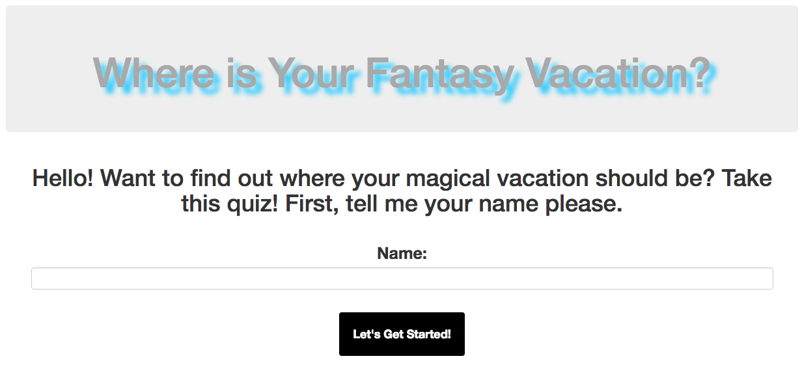
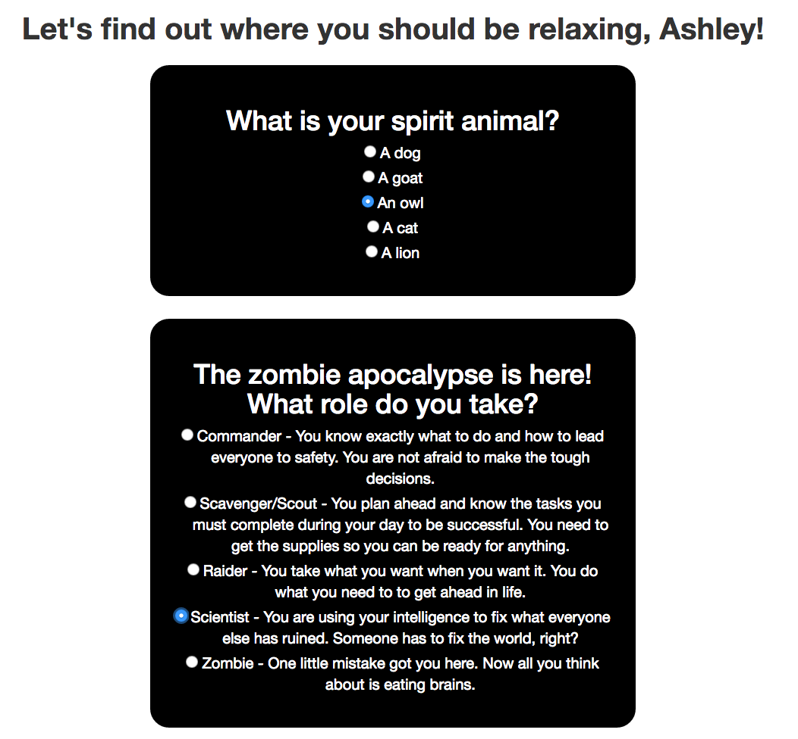
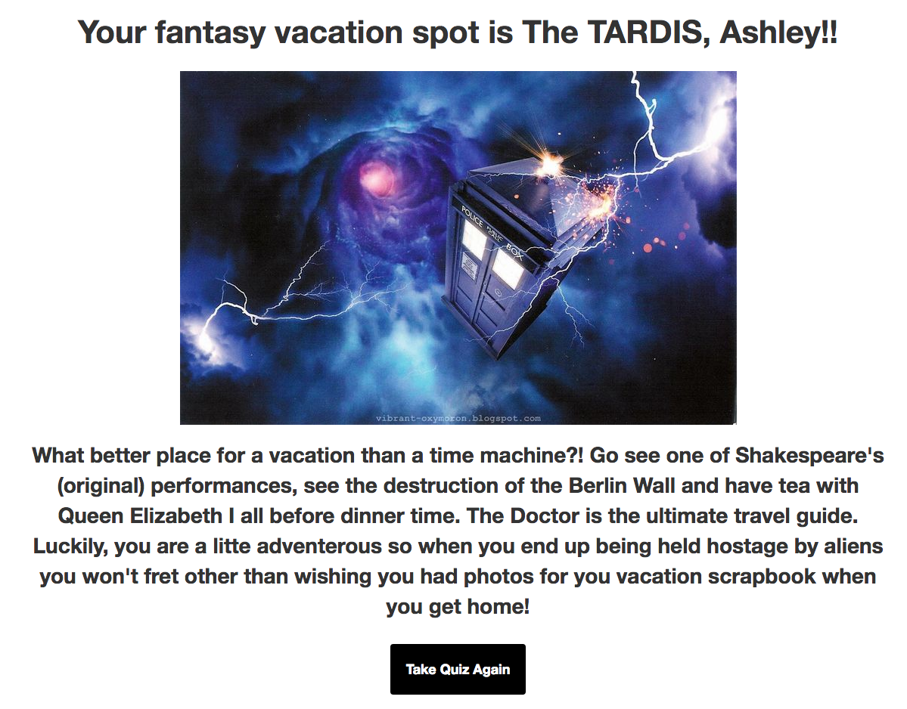

# _Fantasy Vacation Quiz!_

#### _Webpage made with HTML, CSS, Bootstrap, JavaScript and jQuery. Current version last edited: March 25th, 2016_

#### By _**Ashley Maceli**_

## Description

_Epicodus Intro to Programming Week 2 independent project. Created a vacation quiz webpage with fictional destinations. With the use of JavaScript, jQuery and branching with if/else statements certain parts of HTML are hidden or shown based on the user's actions and choices for the quiz._

##GitHub Pages Link

http://ashleyraymaceli.github.io/vacation-quiz

## Known Bugs

_When name is entered in lowercase letters the name will be returned with the first letter capitalized. If uppercase letters are inputed, they will be returned but the first letter will be capitalized. Trying to find a way to change the first character (at index 0) to upper case and the rest to lower case._

## Support and contact details

_Please contact Ashley via e-mail with issues_
_ashley.maceli@gmail.com_

## Technologies Used

_HTML, CSS, Bootstrap, JavaScript, jQuery_

### License

The MIT License (MIT)

Copyright (c) [2016] [Ashley Maceli]

Permission is hereby granted, free of charge, to any person obtaining a copy
of this software and associated documentation files (the "Software"), to deal
in the Software without restriction, including without limitation the rights
to use, copy, modify, merge, publish, distribute, sublicense, and/or sell
copies of the Software, and to permit persons to whom the Software is
furnished to do so, subject to the following conditions:

The above copyright notice and this permission notice shall be included in all
copies or substantial portions of the Software.

THE SOFTWARE IS PROVIDED "AS IS", WITHOUT WARRANTY OF ANY KIND, EXPRESS OR
IMPLIED, INCLUDING BUT NOT LIMITED TO THE WARRANTIES OF MERCHANTABILITY,
FITNESS FOR A PARTICULAR PURPOSE AND NONINFRINGEMENT. IN NO EVENT SHALL THE
AUTHORS OR COPYRIGHT HOLDERS BE LIABLE FOR ANY CLAIM, DAMAGES OR OTHER
LIABILITY, WHETHER IN AN ACTION OF CONTRACT, TORT OR OTHERWISE, ARISING FROM,
OUT OF OR IN CONNECTION WITH THE SOFTWARE OR THE USE OR OTHER DEALINGS IN THE
SOFTWARE.
